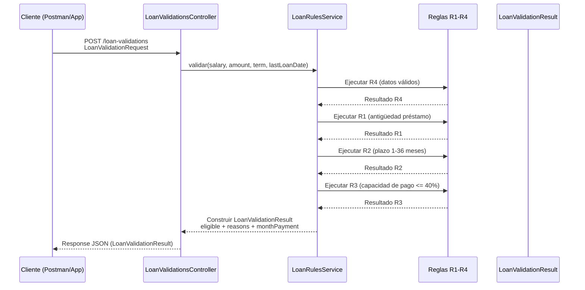
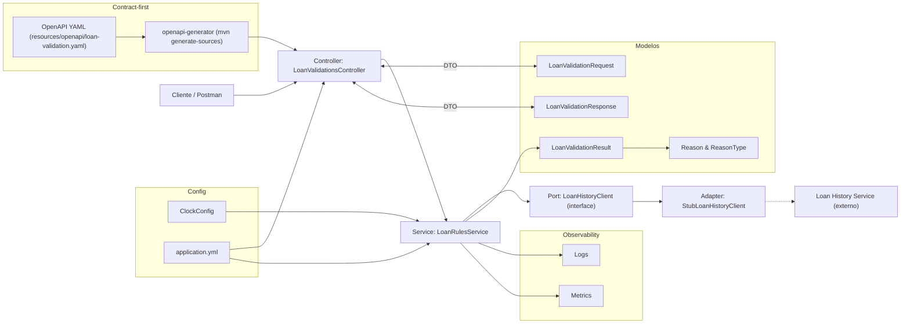

# Arquitectura — Loan Validation

## C1 — Diagrama de Secuencia


## C2 — Diagrama de Componentes


## C3 — Diagrama de flujo (proceso)
```mermaid
flowchart TD
    START([Inicio])
    V4[Validar datos (R4)]
R1{Antiguedad ≤ 3m?}
R2{Plazo 1..36?}
R3{Capacidad ≤ 40%?}
MP[Calcular monthlyPayment]
APROBAR([Aprobar solicitud])
RECH([Rechazar solicitud])
FIN([Fin])

START --> V4
V4 -->|Invalidos| RECH
V4 -->|OK| R1
R1 -->|No| RECH
R1 -->|Si| R2
R2 -->|No| RECH
R2 -->|Si| R3
R3 -->|No| RECH
R3 -->|Si| MP
MP --> APROBAR
RECH --> FIN
APROBAR --> FIN

```
