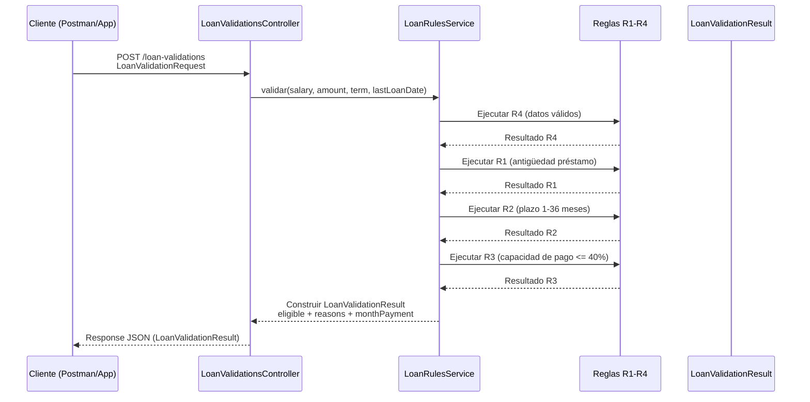

# Arquitectura — Loan Validation

## C3 — Diagrama de Secuencia


## C4 — Flowchart (Rules & Pipeline)
```mermaid
flowchart LR
  %% === Externo ===
  C[Cliente - Postman / App] -->|POST /loan-validations| CTRL

  %% === Microservicio ===
  subgraph SVC[loan-validation - Spring Boot WebFlux]
    direction TB
    CTRL[Controller - LoanValidationsController] --> SRV[Service - LoanRulesService]

    subgraph RULES[Business Rules]
      direction TB
      R4[R4: Datos válidos] 
      R1[R1: Antigüedad - <3m]
      R2[R2: Plazo - 1..36]
      R3[R3: Capacidad - ≤ 40% sueldo]
    end

    SRV --> R4
    SRV --> R1
    SRV --> R2
    SRV --> R3

    MP[(monthlyPayment = requestedAmount / termMonths)]
    SRV --> MP

    subgraph CONTRACT[Contract-first]
      OA[(OpenAPI YAML - src/main/resources/openapi/loan-validation.yaml)]
      GEN[[openapi-generator - mvn generate-sources]]
    end
    OA --> GEN --> CTRL
    GEN --> MDL[Modelos DTO - (LoanValidationRequest/Result)]

    subgraph QA[Quality]
      TST[[JUnit/Mockito - src/test]]
      JACO[[JaCoCo - coverage]]
      CS[[Checkstyle - verify]]
    end
    TST --> JACO
    TST --> CTRL
    TST --> SRV
    CS -->|verifica estilo| SVC

    CFG[(application.yml - server.port=8080)]
  end

  note right of SVC
    Stateless (sin BD)
    Clock inyectable para tests
  end note
```
